       
# About
        
The Disease Maps Project as a large-scale community effort to apply systems biomedicine paradigms in building knowledge repositories, mapping omics data on molecular mechanisms, and simulation of their perturbations for effect prediction.

Our international and interdisciplinary community grows since 2015, fueled by exchanges during annual meetings, regular virtual meetings, and over a dedicated Slack channel. We collaborate closely with the communities of the systems biology neighbourhood, including [SBML](https://sbml.org/community/), [SBGN](https://sbgn.github.io/), and [ELIXIR Systems Biology](https://elixir-europe.org/communities/systems-biology), and [Reactome](https://reactome.org/) and [WikiPathways](https://www.wikipathways.org/) databases.

## Get involved

**[Contact us!](../contact)** We are actively expanding the list of areas covered by the Disease Maps Project and are looking for new contributors interested in molecular mechanisms of physiology and diseases: computational biologists, clinicians or experimental biologists. If you are working on one of the projects which are already listed on this website, we would be happy to collaborate.
        
## Project Leaders

Project leaders develop and refine the concept of disease maps, coordinate the activities of the community effort, help to initiate new maps, advise on best practices and offer guidelines.

<table>
<tr>
<td style="width: 200px;">
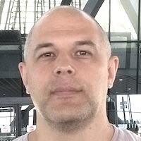
</td>
<td style="width: 200px;">
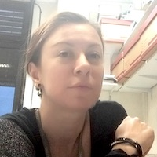
</td>
<td style="width: 200px;">
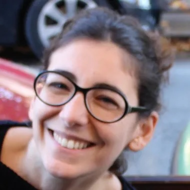
</td>
<td style="width: 200px;">
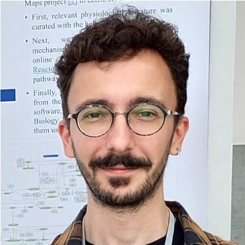
</td>
</tr>
<tr>
<td style="width: 200px; text-align:left; vertical-align:top;"><strong>Alexander Mazein</strong>
Researcher, Luxembourg Institute of Health, Luxembourg
</td>
<td style="width: 200px; text-align:left; vertical-align:top;"><strong>Anna Niarakis</strong>
Professor, University of Toulouse III - Paul Sabatier, Toulouse, France
</td>
<td style="width: 200px; text-align:left; vertical-align:top;"><strong>Laurence Calzone</strong>
Researcher, Institut Curie, Paris, France
</td>
<td style="width: 200px; text-align:left; vertical-align:top;"><strong>Luiz Ladeira</strong>
Researcher, University of Liège, Liège, Belgium
</td>
</tr>
<tr>
<td style="width: 200px;">
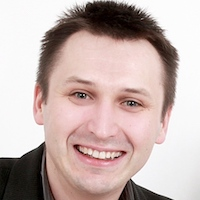
</td>
<td style="width: 200px;">
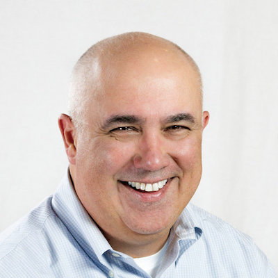
</td>
<td style="width: 200px;">
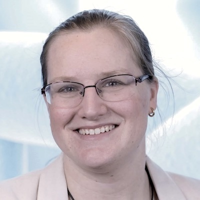
</td>
<td style="width: 200px;">
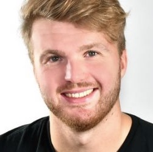
</td>

</tr>
<tr>
<td style="width: 200px; text-align:left; vertical-align:top;"><strong>Marek Ostaszewski</strong>
Researcher, University of Luxembourg, Belvaux, Luxembourg
</td>
<td style="width: 200px; text-align:left; vertical-align:top;"><strong>Marc Gillespie</strong>
Professor, St. John's University, New York, US
</td>
<td style="width: 200px; text-align:left; vertical-align:top;"><strong>Martina Kutmon</strong>
Professor, Maastricht University, Maastricht, Netherlands
</td>
<td style="width: 200px; text-align:left; vertical-align:top;"><strong>Matti Hoch</strong>
Researcher, University of Rostock, Rostock, Germany
</td>
</tr>
</table>    

## Principal Investigators

Principal investigators support and advise the Community.

<table>
<tr>
<td style="width: 200px;">
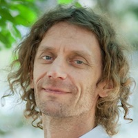
</td>
<td style="width: 200px;">
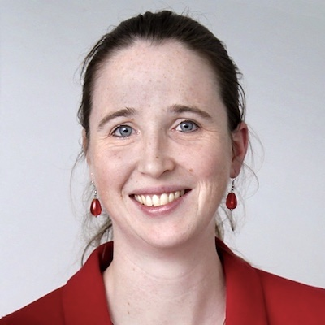
</td>
<td style="width: 200px;">
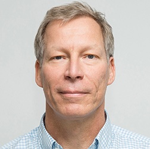
</td>
<td style="width: 200px;">
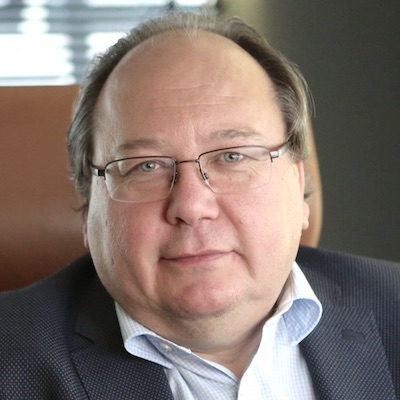
</td>
</tr>
<tr>
<td style="width: 200px; text-align:left; vertical-align:top;"><strong>Emmanuel Barillot, PhD</strong>
Director of the U900 Institut Curie/INSERM/Ecole des Mines ParisTech, Paris, France
</td>
<td style="width: 200px; text-align:left; vertical-align:top;"><strong>Liesbet Geris, PhD</strong>
Head of the Biomechanics Research Unit, University of Liège, Liège, Belgium and KU Leuven, Leuven, Belgium. Executive Director of the Virtual Physiological Human Institute (VPHi)
</td>
<td style="width: 200px; text-align:left; vertical-align:top;"><strong>Olaf Wolkenhauer, PhD</strong>
Head of the Department of Systems Biology & Bioinformatics, Faculty of Computer Science and Electrical Engineering, University of Rostock, Germany
</td>
<td style="width: 200px; text-align:left; vertical-align:top;"><strong>Reinhard Schneider, PhD</strong>
Head of Bioinformatics Core, Luxembourg Centre for Systems Biomedicine, University of Luxembourg, Belvaux, Luxembourg
</td>
</tr>
</table>

## Founding members
We would like to thank our founding mebers for their longstanding and enthusiastic support to the concept of disease maps.

<table>
<tr>
<td style="width: 200px;">
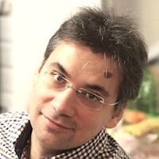
</td>
<td style="width: 200px;">
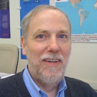
</td>
<td style="width: 200px;">
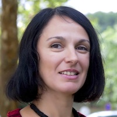
</td>
<td style="width: 200px;">
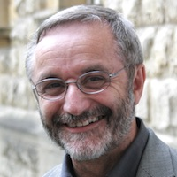
</td>
</tr>
<tr>
<td style="width: 200px; text-align:left; vertical-align:top;"><strong>Andrei Zinovyev</strong>
Institut Curie, Paris, France
</td>
<td style="width: 200px; text-align:left; vertical-align:top;"><strong>Charles Auffray</strong>
European Institute for Systems Biology and Medicine, Lyon, France
</td>
<td style="width: 200px; text-align:left; vertical-align:top;"><strong>Inna Kuperstein</strong>
Institut Curie, Paris, France
</td>
<td style="width: 200px; text-align:left; vertical-align:top;"><strong>Rudi Balling</strong>
Luxembourg Centre for Systems Biomedicine, University of Luxembourg, Belvaux, Luxembourg
</td>
</tr>
</table>
        
<!--### Scientific Advisory Board

The Scientific Advisory Board is composed of scientists with expertise in large-scale systems biology and translational medicine projects. The board provides guidance regarding the goals and the roadmap for the Disease Maps Project.

The list of the Scientific Advisory Board members is being confirmed.
-->

## Acknowledgements

Many published disease maps were developed in collaboration with the <a href="http://www.sbi.jp/" target="_blank">Systems Biology Institute</a>, Tokyo, Japan (Mizuno et al., 2012, <a href="https://www.ncbi.nlm.nih.gov/pubmed/22647208" target="_blank">PMID 22647208</a>; Matsuoka et al., 2013, <a href="https://www.ncbi.nlm.nih.gov/pubmed/24088197" target="_blank">PMID 24088197</a>; Fujita et al., 2014, <a href="https://www.ncbi.nlm.nih.gov/pubmed/23832570" target="_blank">PMID 23832570</a>; Kuperstein et al., 2015, <a href="https://www.ncbi.nlm.nih.gov/pubmed/26192618" target="_blank">PMID 26192618</a>). We would like to underline the role of Prof. Hiroaki Kitano in pioneering the process description representation of signalling networks and initiating first comprehensive disease-relevant extensive reconstructions of signalling pathways (Oda et al., 2005, <a href="https://www.ncbi.nlm.nih.gov/pubmed/16729045" target="_blank">PMID 16729045</a>; Oda and Kitano, 2006, <a href="https://www.ncbi.nlm.nih.gov/pubmed/16738560" target="_blank">PMID 16738560</a>; Caron et al., 2010, <a href="https://www.ncbi.nlm.nih.gov/pubmed/21179025" target="_blank">PMID 21179025</a>).

