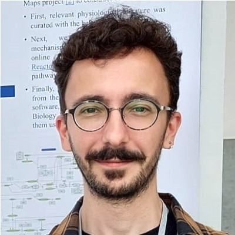
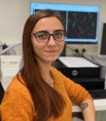
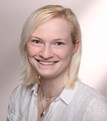
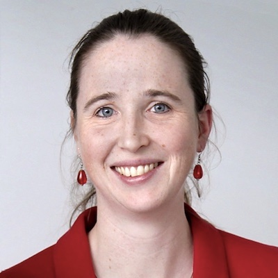
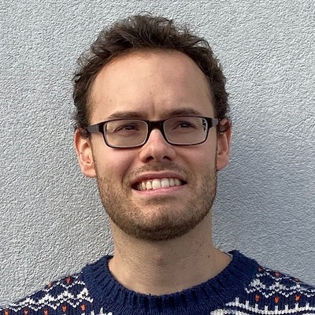
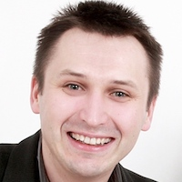
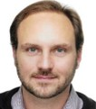
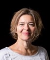
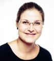

# Immune System Development

## Human Immune System Development Map (HIDmap)

**Development status:** Active development\
**Sustainable support:** [Alternative method development for environmental toxicity testing](https://iuf-duesseldorf.de/forschung/arbeitsgruppen/ag-koch/), [MINERVA Platform](https://minerva.pages.uni.lu/)\
**License:** [Creative Commons Attribution 4.0 International (CC BY 4.0) License](https://creativecommons.org/licenses/by/4.0/)\
**Construction tool:** [CellDesigner](https://www.celldesigner.org/)\
**Funding:** [Clariant Produkte (Deutschland) GmbH, IUF - Leibniz Research Institute for Environmental Medicine](https://www.clariant.com/de/Corporate)\
**Contact:** Christiane Spruck, IUF – Leibniz Research Institute for Environmental Medicine, christiane.spruck(at)iuf-duesseldorf.de

### Description

The development of the human immune system is biologically complex, as different niches and cell types are involved in the various stages of development. To date, knowledge about the development of the immune system relies primarily on animal data, and the availability of in vitro and in silico new approach methodologies (NAMs) to assess effects on the developing immune system without the use of animals is highly desirable. In order to capture the biological complexity of the developing immune system and guide the development of in vitro and in silico NAMs, we started building a map on the human immune system development. A physiological map is a tool derived from the Disease Maps project that focuses on the underlying undisturbed physiological processes. Based on extensive literature curation, the human immune system development map (HIDmap) graphically represents the specific cell type niches and complex biological interactions involved during prenatal development, including cell migration, cell-cell interactions, and signaling molecules. The major niches involved in the immune system development are the aorta-gonad-mesonephros region, yolk sac, fetal liver, bone marrow, spleen, and thymus. Cell types that play a role in the development of the immune system include, but are not limited to, hematopoietic stem cells, progenitor cells, T-cells, B-cells, dendritic cells, macrophages, and monocytes. The main goal of the HIDmap is to map as comprehensively as possible, the developing human immune system to identify existing knowledge gaps and provide a valuable resource for both research and regulatory purposes in pharmacology and toxicology. In this context, the HIDmap is envisaged to provide a basis for the development of adverse outcome pathways (AOPs), computational models, and human-based in vitro NAMs for toxicological testing, therefore presenting the biological basis for a NAM-based test battery for developmental immunotoxicity (DIT).

### **Development Team**

+------------------------------------------------+--------------------------------------------------------------------------------------------------------------+
| {width="120"}  | **Christiane Spruck, M.Sc.**                                                                                 |
|                                                |                                                                                                              |
|                                                | **IUF – Leibniz Research Institute for Environmental Medicine**                                              |
|                                                |                                                                                                              |
|                                                | Biologist, PhD Student                                                                                       |
|                                                |                                                                                                              |
|                                                | Development of the Human Immune System Development Map                                                       |
+------------------------------------------------+--------------------------------------------------------------------------------------------------------------+
| {width="120"}       | **Luiz Ladeira, PhD**                                                                                        |
|                                                |                                                                                                              |
|                                                | **GIGA Molecular & Computational Biology, University of Liège, Belgium**                                     |
|                                                |                                                                                                              |
|                                                | Postdoctoral researcher\                                                                                     |
|                                                | Curation of the Human Immune System Development Map                                                          |
+------------------------------------------------+--------------------------------------------------------------------------------------------------------------+
| {width="120"}   | **Eliška Kuchovská, PhD**                                                                                    |
|                                                |                                                                                                              |
|                                                | **IUF – Leibniz Research Institute for Environmental Medicine**                                              |
|                                                |                                                                                                              |
|                                                | Postdoctoral researcher                                                                                      |
|                                                |                                                                                                              |
|                                                | Review and editing                                                                                           |
+------------------------------------------------+--------------------------------------------------------------------------------------------------------------+
| {width="120"}       | **Lena Teschke, B.Sc.**                                                                                      |
|                                                |                                                                                                              |
|                                                | **IUF – Leibniz Research Institute for Environmental Medicine**                                              |
|                                                |                                                                                                              |
|                                                | Biologist, master student                                                                                    |
|                                                |                                                                                                              |
|                                                | Development of the Human Immune System Development Map                                                       |
+------------------------------------------------+--------------------------------------------------------------------------------------------------------------+
| {width="120"}      | **Liesbet Geris, PhD**                                                                                       |
|                                                |                                                                                                              |
|                                                | **GIGA Molecular & Computational Biology, University of Liège, Belgium**                                     |
|                                                |                                                                                                              |
|                                                | Professor in Biomechanics and Computational Tissue Engineering,                                              |
|                                                |                                                                                                              |
|                                                | Supervision                                                                                                  |
+------------------------------------------------+--------------------------------------------------------------------------------------------------------------+
| {width="120"}   | **Bernard Staumont**                                                                                         |
|                                                |                                                                                                              |
|                                                | **GIGA Molecular & Computational Biology, University of Liège, Belgium**                                     |
|                                                |                                                                                                              |
|                                                | Postdoc Researcher & Project Manager,                                                                        |
|                                                |                                                                                                              |
|                                                | Supervision, review and editing                                                                              |
+------------------------------------------------+--------------------------------------------------------------------------------------------------------------+
| {width="120"} | **Marek Ostaszewski, PhD**\                                                                                  |
|                                                | **University of Luxembourg, Luxembourg**                                                                     |
|                                                |                                                                                                              |
|                                                | Luxembourg Centre for Systems Biomedicine\                                                                   |
|                                                | Researcher                                          MINERVA support                                          |
+------------------------------------------------+--------------------------------------------------------------------------------------------------------------+
| {width="120"}      | **Susann Fayyaz, PhD**                                                                                       |
|                                                |                                                                                                              |
|                                                | **Clariant Produkte (Deutschland) GmbH**                                                                     |
|                                                |                                                                                                              |
|                                                | Expert Toxicology                                                                                            |
|                                                |                                                                                                              |
|                                                | Project administration and funding body                                                                      |
+------------------------------------------------+--------------------------------------------------------------------------------------------------------------+
| {width="120"}       | **Fabian Grimm, PhD**                                                                                        |
|                                                |                                                                                                              |
|                                                | **Clariant Produkte (Deutschland) GmbH**                                                                     |
|                                                |                                                                                                              |
|                                                | Head of Toxicology and Ecotoxicology                                                                         |
|                                                |                                                                                                              |
|                                                | Project administration and funding body                                                                      |
+------------------------------------------------+--------------------------------------------------------------------------------------------------------------+
| {width="120"}     | **Katharina Koch, PhD**                                                                                      |
|                                                |                                                                                                              |
|                                                | **IUF – Leibniz Research Institute for Environmental Medicine**                                              |
|                                                |                                                                                                              |
|                                                | **DNTOX GmbH, Duesseldorf, Germany**                                                                         |
|                                                |                                                                                                              |
|                                                | Scientist and interim [working group](https://iuf-duesseldorf.de/en/research/working-groups/wg-koch/) leader |
|                                                |                                                                                                              |
|                                                | Supervision, project administration and funding acquisition                                                  |
+------------------------------------------------+--------------------------------------------------------------------------------------------------------------+
| {width="120"}     | **Ellen Fritsche, MD**                                                                                       |
|                                                |                                                                                                              |
|                                                | **Swiss Centre for Applied Human**                                                                           |
|                                                |                                                                                                              |
|                                                | **Toxicology (SCAHT), Basel, Switzerland** (Director)                                                        |
|                                                |                                                                                                              |
|                                                | **IUF – Leibniz Research Institute for Environmental Medicine** (former working group leader)                |
|                                                |                                                                                                              |
|                                                | **Medical Faculty, Heinrich Heine University Düsseldorf, Duesseldorf, Germany**                              |
|                                                |                                                                                                              |
|                                                | **DNTOX GmbH, Duesseldorf, Germany**                                                                         |
|                                                |                                                                                                              |
|                                                | Professor for Environmental Toxicology                                                                       |
|                                                |                                                                                                              |
|                                                | Project generation, funding acquisition, administration and supervision                                      |
+------------------------------------------------+--------------------------------------------------------------------------------------------------------------+
| {width="120"}       | **Julia Tigges, PhD**                                                                                        |
|                                                |                                                                                                              |
|                                                | **IUF – Leibniz Research Institute for Environmental Medicine**                                              |
|                                                |                                                                                                              |
|                                                | Scientist                                                                                                    |
|                                                |                                                                                                              |
|                                                | Supervision, project administration and funding acquisition                                                  |
+------------------------------------------------+--------------------------------------------------------------------------------------------------------------+

### Funding

This PhD project is funded by the company [Clariant Produkte (Deutschland) GmbH](https://www.clariant.com/de/Corporate) and the [IUF - Leibniz Research Institute for Environmental Medicine](https://iuf-duesseldorf.de/en/).
